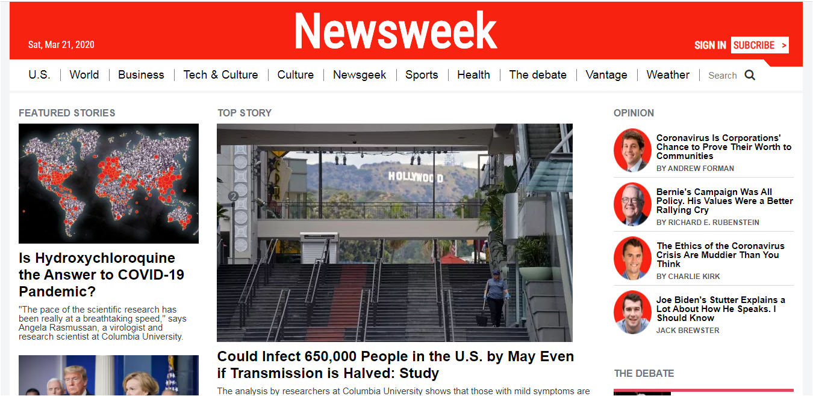

# NewsweekClone

> Bootstrap.

This project shows a web page similar to the newsweek web page that shows how to work with bootstrap in order to achive the page design

## Built With

- html, css, bootstrap
- vscode

## Live Demo

[Live Demo Link](path)

## Getting Started

To get a local copy up and running follow these simple example steps.

### Prerequisites
- Web browser
- Code editor
- Git and Github

### Usage
- Clone the project to your local machine 
- Open the index file in your browser

## Author

- Okiror Frank

👤 **Author details**

- Github: [Okiror Frank](https://github.com/frankopkusianwar)
- Twitter: [Okiror Frank](https://twitter.com/franko0781)
- Linkedin: [Okiror Frank](https://linkedin.com/in/frank-okiror-250076b5)

## 🤝 Contributing

Contributions, issues and feature requests are welcome!

Feel free to check the [issues page](issues/).

## Show your support

Give a ⭐️ if you like this project!

## Acknowledgments

- Apple

## 📝 License

This project is [MIT](lic.url) licensed.
